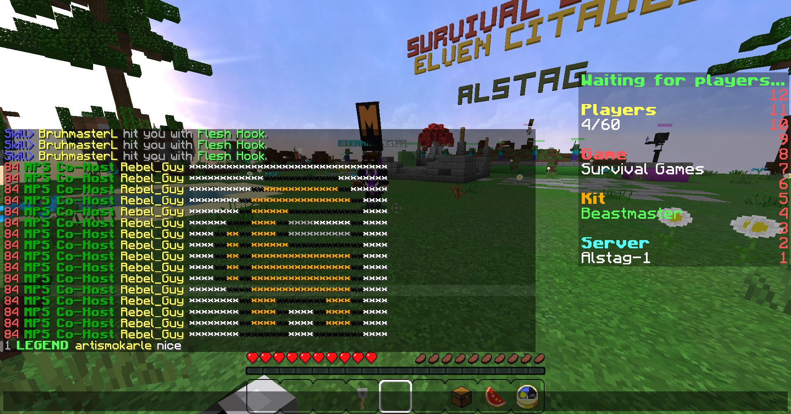

# mineplex-pixel-art

Command-line tool that converts a low-resolution image into a series of chat messages that can be pasted to the Mineplex chat to reproduce the image.

For example, using this image


as an input will generate the required chat messages for displaying it on Mineplex:




## Usage

Install the dependencies:
> npm install

Process the example image:
> node index
```
0 ********************************
1 ************&0************&f********
2 **********&0**&6************&0**&f******
3 ********&0**&6****************&0**&f****
4 ********&0**&6******&0************&f****
5 ******&0****&6****&0**&7****&f******&0**&f****
6 ****&0**&6**&0**&6****&0**&7**********&0**&f****
7 ****&0**&6**&0**&6******&0************&f****
8 ****&0**&6**&0**&6****************&0**&f****
9 ****&0**&6**&0**&6****************&0**&f****
10 ****&0**&6**&0**&6****************&0**&f****
11 ******&0****&6****************&0**&f****
12 ********&0**&6****&0********&6****&0**&f****
13 ********&0**&6****&0**&f****&0**&6****&0**&f****
14 ********&0**&6****&0**&f****&0**&6****&0**&f****
15 ********&0********&f****&0********&f****
```

Process a custom image:
> node index path/to/image.png